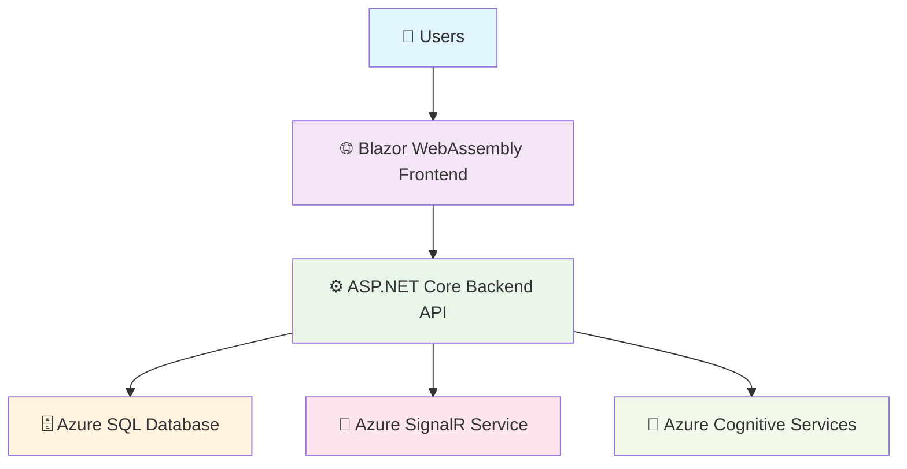
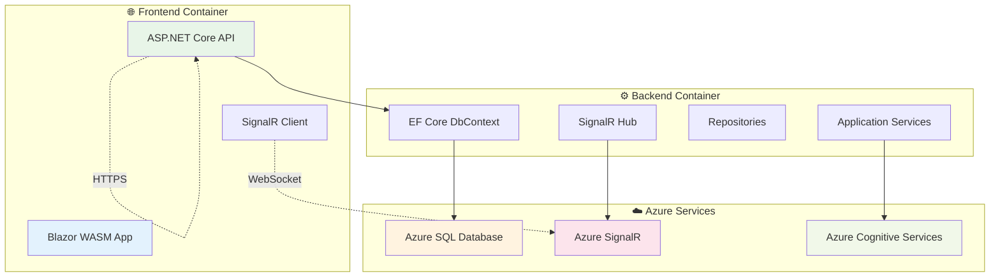
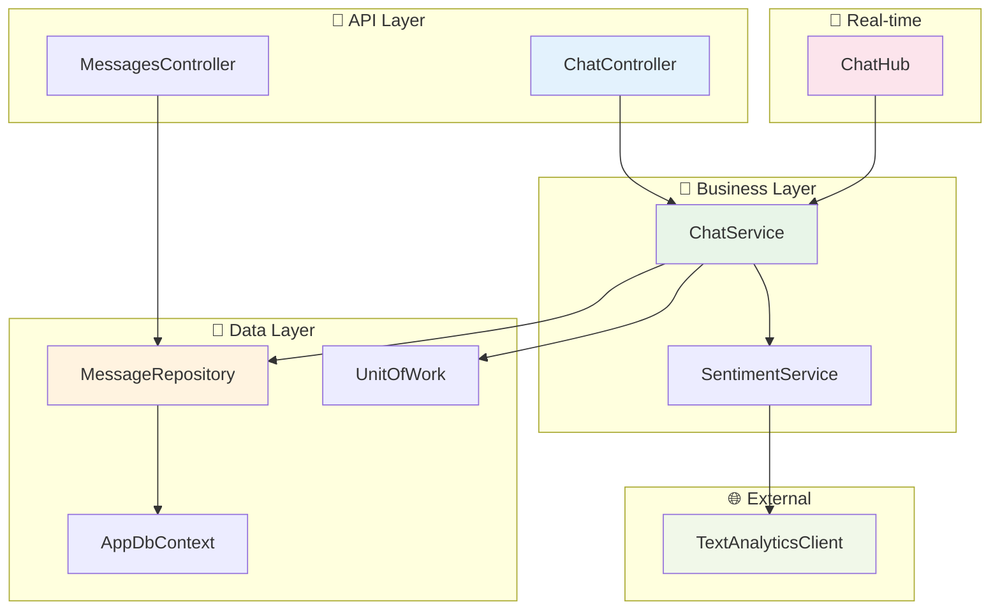
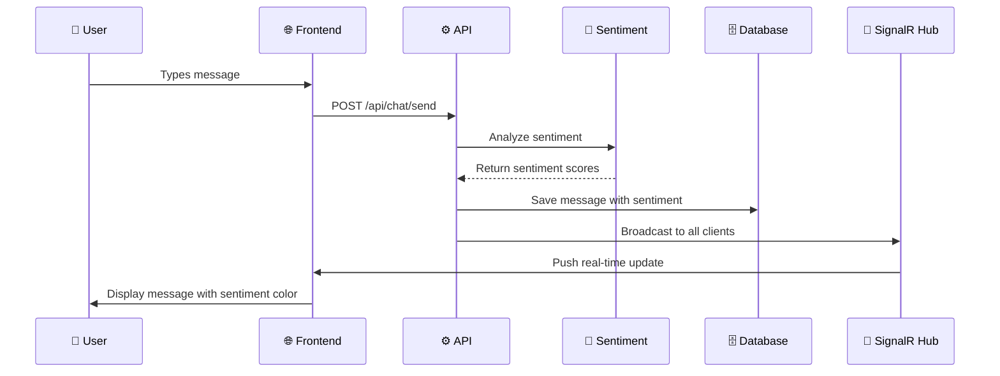

# Real-time Chat Application with Sentiment Analysis

## 📋 Overview

This is a **Senior-level Real-time Chat Application** built with modern .NET technologies, featuring real-time messaging and AI-powered sentiment analysis. The application demonstrates production-ready architecture with SOLID principles, clean architecture patterns, and comprehensive DevOps practices.

### ✨ Key Features

- 🚀 **Real-time messaging** via SignalR
- 🧠 **Sentiment analysis** using Azure Cognitive Services
- 🎨 **Dynamic UI highlighting** based on message sentiment
- 💾 **Persistent storage** in Azure SQL Database
- 🐳 **Docker containerization** for consistent deployment
- 🔄 **CI/CD pipelines** with GitHub Actions
- 📊 **C4 architecture documentation** with Mermaid diagrams

---

## 🏗️ Architecture

### Context Diagram (C4 Level 1)



**Description:**
- Users interact with the responsive Blazor WASM frontend
- Frontend communicates with backend API and SignalR
- Backend processes messages and performs sentiment analysis
- All messages are stored in Azure SQL Database
- SignalR enables real-time message broadcasting

### Container Diagram (C4 Level 2)



### Component Diagram (C4 Level 3)



### SignalR + Sentiment Flow



---

## 🛠️ Technology Stack

### Backend
- **ASP.NET Core 8** - Web API framework
- **Entity Framework Core 8** - ORM with Code First migrations
- **SignalR** - Real-time communication
- **Azure Cognitive Services** - Text Analytics for sentiment
- **Repository + Unit of Work** - Data access patterns
- **SOLID Principles** - Clean architecture

### Frontend
- **Blazor WebAssembly** - Modern SPA framework
- **SignalR Client** - Real-time connectivity
- **Responsive CSS** - Mobile-friendly design
- **Component-based architecture** - Reusable UI components

### DevOps & Infrastructure
- **Docker & Docker Compose** - Containerization
- **GitHub Actions** - CI/CD pipelines
- **Azure Web Apps** - Cloud hosting
- **Azure SQL Database** - Managed database
- **Azure SignalR Service** - Scalable real-time
- **Mermaid Diagrams** - Architecture documentation

---

## 🚀 Quick Start

### Prerequisites
- [.NET 8 SDK](https://dotnet.microsoft.com/download/dotnet/8.0)
- [Docker & Docker Compose](https://www.docker.com/products/docker-desktop)
- [Git](https://git-scm.com/)

### Local Development

1. **Clone the repository**
   ```bash
   git clone https://github.com/yourusername/realtime-chat-sentiment.git
   cd realtime-chat-sentiment
   ```

2. **Initialize development environment**
   ```bash
   chmod +x cicd/scripts/init-dev.sh
   ./cicd/scripts/init-dev.sh
   ```

3. **Access the application**
   - 🌐 Frontend: http://localhost:5000
   - 🔧 Backend API: http://localhost:5001
   - 📖 Swagger Documentation: http://localhost:5001/swagger
   - 🗄️ Database: localhost:1433

### Manual Setup

1. **Start services with Docker Compose**
   ```bash
   docker-compose up --build -d
   ```

2. **Apply database migrations**
   ```bash
   chmod +x cicd/scripts/migrate-db.sh
   ./cicd/scripts/migrate-db.sh
   ```

3. **Configure Azure Cognitive Services (Optional)**
   ```bash
   # Edit .env file
   AZURE_TEXT_ANALYTICS_ENDPOINT=your_endpoint
   AZURE_TEXT_ANALYTICS_KEY=your_key
   ```

---

## 🌐 Azure Deployment

### Automated Deployment

1. **Run deployment script**
   ```bash
   chmod +x cicd/scripts/deploy-azure.sh
   SQL_PASSWORD=YourSecurePassword ./cicd/scripts/deploy-azure.sh
   ```

2. **Configure Azure Cognitive Services**
   - Create Text Analytics resource in Azure Portal
   - Add connection strings to App Settings

### Manual Azure Setup

1. **Create Azure Resources**
   ```bash
   # Resource Group
   az group create --name ChatAppResourceGroup --location "East US"
   
   # SQL Database
   az sql server create --name chatapp-sqlserver --resource-group ChatAppResourceGroup --admin-user chatadmin --admin-password YourSecurePassword
   az sql db create --name ChatDb --server chatapp-sqlserver --resource-group ChatAppResourceGroup
   
   # App Service Plan
   az appservice plan create --name ChatAppServicePlan --resource-group ChatAppResourceGroup --sku B1 --is-linux
   
   # Web Apps
   az webapp create --name chatapp-backend --resource-group ChatAppResourceGroup --plan ChatAppServicePlan --runtime "DOTNET|8.0"
   az webapp create --name chatapp-frontend --resource-group ChatAppResourceGroup --plan ChatAppServicePlan --runtime "DOTNET|8.0"
   ```

2. **Deploy Applications**
   ```bash
   # Backend
   dotnet publish backend-wasm/backend-wasm.csproj --configuration Release --output ./backend-publish
   az webapp deployment source config-zip --resource-group ChatAppResourceGroup --name chatapp-backend --src ./backend-publish.zip
   
   # Frontend
   dotnet publish frontend/blazor-wasm/frontend-blazor-wasm.csproj --configuration Release --output ./frontend-publish
   az webapp deployment source config-zip --resource-group ChatAppResourceGroup --name chatapp-frontend --src ./frontend-publish.zip
   ```

---

## 📁 Project Structure

```
realtime-chat-sentiment/
├── 📁 backend-wasm/                    # ASP.NET Core Backend
│   ├── 📁 src/
│   │   ├── 📁 WebApi/                  # API Controllers & Hubs
│   │   ├── 📁 Application/             # Business Logic & Services
│   │   ├── 📁 Domain/                  # Entities & Enums
│   │   └── 📁 Infrastructure/          # Data Access & External Services
│   ├── 📄 Dockerfile
│   └── 📄 backend-wasm.csproj
├── 📁 frontend/blazor-wasm/            # Blazor WASM Frontend
│   ├── 📁 Pages/                       # Razor Pages
│   ├── 📁 Components/                  # Reusable Components
│   ├── 📁 Services/                    # Frontend Services
│   ├── 📁 wwwroot/                     # Static Assets
│   ├── 📄 Dockerfile
│   └── 📄 frontend-blazor-wasm.csproj
├── 📁 cicd/                            # CI/CD Configuration
│   ├── 📁 scripts/                     # Deployment Scripts
│   └── 📁 docker/                      # Docker Configurations
├── 📁 .github/workflows/               # GitHub Actions
├── 📄 docker-compose.yml               # Multi-container setup
├── 📄 .env                             # Environment variables
└── 📄 README.md                        # This file
```

---

## 🔧 Configuration

### Environment Variables

| Variable | Description | Default |
|----------|-------------|---------|
| `ConnectionStrings__DefaultConnection` | SQL Server connection string | `Server=localhost;Database=ChatDb;...` |
| `AzureTextAnalytics__Endpoint` | Azure Cognitive Services endpoint | Empty (sentiment disabled) |
| `AzureTextAnalytics__Key` | Azure Cognitive Services key | Empty (sentiment disabled) |
| `ASPNETCORE_ENVIRONMENT` | ASP.NET Core environment | `Development` |

### Azure Cognitive Services Setup (Optional)

1. **Create Text Analytics Resource**
   ```bash
   az cognitiveservices account create \
     --name chat-sentiment-analysis \
     --resource-group ChatAppResourceGroup \
     --kind TextAnalytics \
     --sku F0 \
     --location "East US"
   ```

2. **Get Keys and Endpoint**
   ```bash
   az cognitiveservices account keys list \
     --name chat-sentiment-analysis \
     --resource-group ChatAppResourceGroup
   ```

3. **Update App Settings**
   ```bash
   az webapp config appsettings set \
     --name chatapp-backend \
     --resource-group ChatAppResourceGroup \
     --settings "AzureTextAnalytics__Endpoint=your_endpoint" "AzureTextAnalytics__Key=your_key"
   ```

---

## 🧪 Testing

### Unit Tests
```bash
# Backend Tests
dotnet test backend-wasm/backend-wasm.csproj

# Frontend Tests
dotnet test frontend/blazor-wasm/frontend-blazor-wasm.csproj
```

### E2E Tests
```bash
# Run all E2E tests
chmod +x cicd/scripts/run-e2e-tests.sh
./cicd/scripts/run-e2e-tests.sh

# Run specific test categories
cd backend-wasm/src/Tests
dotnet test --filter "Category=API"     # API E2E tests
dotnet test --filter "Category=SignalR" # SignalR E2E tests
dotnet test --filter "Category=UI"      # UI E2E tests with Playwright
```

### E2E Test Coverage
- **API E2E Tests**: Complete message flow, validation, error handling
- **SignalR E2E Tests**: Real-time communication, connection management, multi-client scenarios
- **UI E2E Tests**: User interactions, responsive design, cross-browser compatibility (Chrome, Firefox, Safari)

### Integration Tests
```bash
# Run with Docker Compose
docker-compose -f docker-compose.test.yml up --abort-on-container-exit
```

### Load Testing
```bash
# Install Apache Benchmark
ab -n 1000 -c 10 http://localhost:5001/api/chat/messages
```

---

## 🔄 CI/CD Pipeline

### GitHub Actions Workflows

1. **Build and Test** (`build.yml`)
   - Triggers on push/PR to main
   - Builds and tests both backend and frontend
   - Uploads build artifacts

2. **Backend Deployment** (`deploy-backend.yml`)
   - Triggers on backend changes
   - Deploys to Azure Web App
   - Runs database migrations

3. **Frontend Deployment** (`deploy-frontend.yml`)
   - Triggers on frontend changes
   - Deploys to Azure Web App

### Required GitHub Secrets

| Secret | Description |
|--------|-------------|
| `AZURE_WEBAPP_BACKEND_PUBLISH_PROFILE` | Backend deployment profile |
| `AZURE_WEBAPP_FRONTEND_PUBLISH_PROFILE` | Frontend deployment profile |
| `AZURE_SQL_CONNECTION_STRING` | Database connection string |

---

## 📊 Monitoring & Logging

### Application Logging
- **Structured logging** with Serilog
- **Log levels**: Debug, Information, Warning, Error
- **Log aggregation**: Application Insights (optional)

### Performance Monitoring
- **Response time tracking**
- **SignalR connection metrics**
- **Database query performance**
- **Memory and CPU usage**

### Health Checks
```bash
# Backend Health
curl http://localhost:5001/health

# Frontend Health
curl http://localhost:5000/health
```

---

## 🔒 Security Considerations

### Authentication & Authorization
- **JWT tokens** for API authentication (future enhancement)
- **CORS policies** for cross-origin requests
- **Rate limiting** for API endpoints

### Data Protection
- **Input validation** and sanitization
- **SQL injection prevention** with EF Core
- **HTTPS enforcement** in production
- **Environment variable encryption** in Azure

### Network Security
- **Azure Firewall** rules
- **VNet integration** (optional)
- **Private endpoints** for Azure services

---

## 🚀 Performance Optimization

### Backend Optimizations
- **Database indexing** on frequently queried columns
- **Connection pooling** with EF Core
- **Response compression** for HTTP requests
- **SignalR message batching**

### Frontend Optimizations
- **Lazy loading** of message history
- **Virtual scrolling** for large message lists
- **Component memoization** with Blazor
- **Asset bundling** and minification

### Caching Strategy
- **In-memory cache** for frequently accessed data
- **Distributed cache** with Redis (optional)
- **Browser caching** for static assets

---

## 🐛 Troubleshooting

### Common Issues

1. **Database Connection Failed**
   ```bash
   # Check SQL Server container
   docker logs chatapp_db_1
   
   # Verify connection string
   echo $CONNECTION_STRING
   ```

2. **SignalR Connection Issues**
   ```bash
   # Check backend logs
   docker logs chatapp_backend_1
   
   # Verify WebSocket support
   wscat -c ws://localhost:5001/chathub
   ```

3. **Frontend Build Errors**
   ```bash
   # Clean and rebuild
   dotnet clean frontend/blazor-wasm/frontend-blazor-wasm.csproj
   dotnet build frontend/blazor-wasm/frontend-blazor-wasm.csproj
   ```

### Debug Mode
```bash
# Enable detailed logging
export ASPNETCORE_ENVIRONMENT=Development
export Logging__LogLevel__Default=Debug
```

---

## 📈 Future Enhancements

### Planned Features
- 📱 **Mobile app** with .NET MAUI
- 🔐 **User authentication** with Azure AD
- 📁 **File sharing** capabilities
- 🎯 **Message reactions** and threading
- 🌍 **Multi-language support**
- 📊 **Analytics dashboard**

### Technical Improvements
- 🔄 **Event sourcing** with Azure Event Hub
- 📈 **Microservices architecture**
- 🧪 **Advanced testing** with Playwright
- 📊 **Real-time analytics** with Power BI
- 🔧 **Feature flags** with Azure App Configuration

---

## 🤝 Contributing

1. **Fork the repository**
2. **Create feature branch** (`git checkout -b feature/amazing-feature`)
3. **Commit changes** (`git commit -m 'Add amazing feature'`)
4. **Push to branch** (`git push origin feature/amazing-feature`)
5. **Open Pull Request**

### Code Style
- Follow **C# coding conventions**
- Use **semantic versioning**
- Write **unit tests** for new features
- Update **documentation** for API changes

---

## 📄 License

This project is licensed under the MIT License - see the [LICENSE](LICENSE) file for details.

---

## 🙏 Acknowledgments

- **Microsoft** for .NET 8 and Azure services
- **SignalR team** for real-time communication framework
- **Blazor team** for modern web development framework
- **Azure Cognitive Services** for AI capabilities

---

## 📞 Support

- 📧 **Email**: support@chatapp.com
- 💬 **Discord**: [Join our community](https://discord.gg/chatapp)
- 🐛 **Issues**: [GitHub Issues](https://github.com/yourusername/realtime-chat-sentiment/issues)
- 📖 **Documentation**: [Wiki](https://github.com/yourusername/realtime-chat-sentiment/wiki)

---

## 🏆 Project Status

✅ **Backend API** - Complete  
✅ **Frontend UI** - Complete  
✅ **Real-time Communication** - Complete  
✅ **Sentiment Analysis** - Complete  
✅ **Docker Configuration** - Complete  
✅ **CI/CD Pipeline** - Complete  
✅ **Azure Deployment** - Complete  
✅ **Documentation** - Complete  

---

**🚀 Ready for production deployment!**  

Made with ❤️ using .NET 8, Blazor, and Azure services
